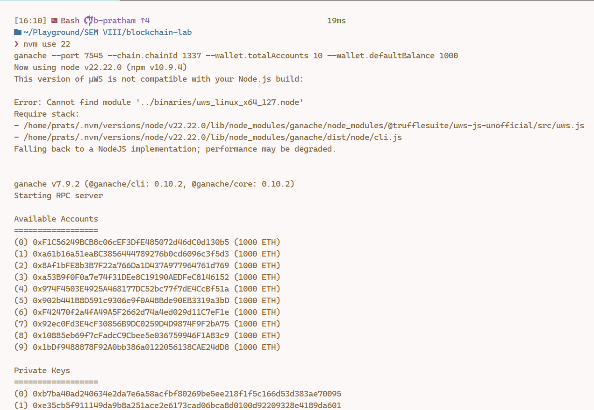
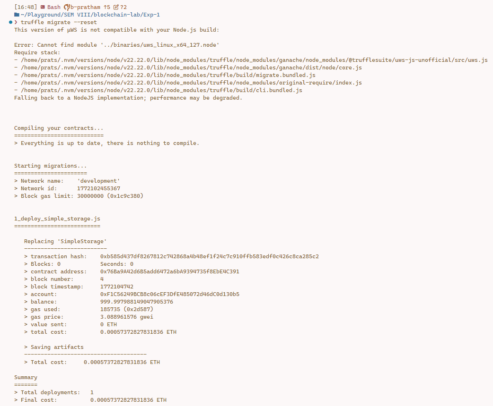
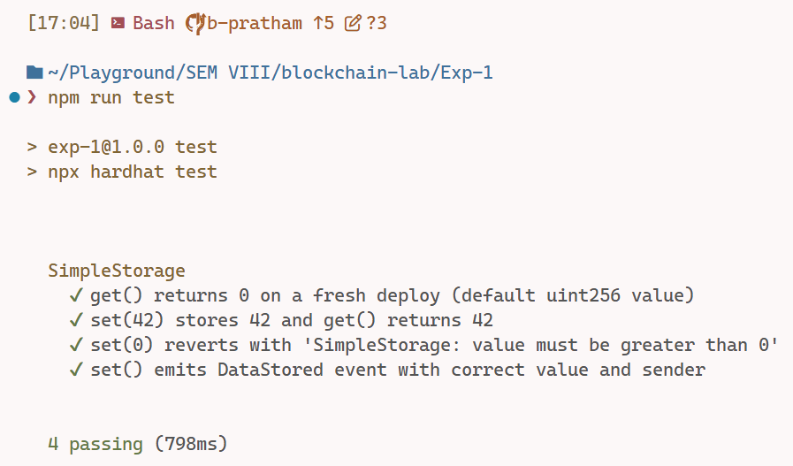

# Exp-1: To Develop and Establish local Blockchain using Truffle

> **Blockchain Lab · ITL801 · University of Mumbai · BE IT SEM VIII · AY 2025-26**

---

## AIM

To Develop and Establish local Blockchain using Truffle.

---

## THEORY

**Truffle Suite**:

- Industry-standard smart contract development framework introduced in 2016 by ConsenSys Inc.
  Last stable version: **v5.11.5** (archived at https://archive.trufflesuite.com/ — ConsenSys
  announced the sunset of Truffle and Ganache in late 2023; v5.11.5 remains fully functional for
  local blockchain experiments under Node.js LTS).
- Provides `truffle compile` (Solidity compiler wrapper), `truffle migrate` (sequential contract
  deployment runner), `truffle test` (Mocha/Chai test runner over Ganache), and
  `truffle console` (interactive REPL connected to any configured network).
- Uses a numbered migration-file convention (`1_deploy_*.js`, `2_deploy_*.js`, …) to track
  on-chain deployment state so already-deployed contracts are skipped on subsequent runs
  unless `--reset` is passed explicitly.
- Connects to any JSON-RPC-compatible Ethereum node via the `networks` block in
  `truffle-config.js` — supports Ganache CLI, Hardhat Network, and public testnet RPC endpoints
  through the same migration API.

**Ganache**:

- Personal Ethereum blockchain simulator maintained by ConsenSys Mesh; distributed as the
  `ganache` package (renamed from `ganache-cli` in v7.0). Version used: **v7.9.2**.
- Spins up a fully functional EVM-compatible chain in memory or on disk (`--db`), providing
  deterministic test accounts pre-funded with configurable ETH balances, instant block mining
  (automine mode), and JSON-RPC + WebSocket endpoints on `localhost`.
- Does not run a real consensus algorithm — transactions are mined immediately, making it ideal
  for rapid local development without tying up real ETH or waiting for network confirmations.
- Ganache v7 flag syntax: `--chain.chainId` (primary) and `--chainId` (backward-compatible alias;
  both map to the same chain ID and the step-by-step commands below use `--chainId 1337` for brevity),
  `--wallet.totalAccounts`, `--wallet.defaultBalance`, and `--port` for custom RPC port selection.

**Ethereum & Solidity**:

- **Ethereum**: Open, permissionless blockchain platform introduced by Vitalik Buterin in 2015.
  Operates on the EVM (Ethereum Virtual Machine) — a stack-based, deterministic runtime that
  executes smart contract bytecode identically across all nodes.
- **Solidity**: Statically-typed, contract-oriented language designed for the EVM; introduced in
  2014 by Gavin Wood. Current stable release as of February 2026: **v0.8.28+**. This experiment
  targets `^0.8.21` (compiler: `solc 0.8.21+commit.d9974bed.Emscripten.clang`).
- Key features used: `pragma solidity ^0.8.21`, `uint256` private state variable, `event` with
  `indexed` parameters for topic-based log filtering, `require` input validation, `external` /
  `view` function visibility, and built-in overflow protection (default in `^0.8.x`).

**Hardhat**:

- Ethereum development environment created by Nomic Foundation (formerly Nomiclabs).
  Version: **v2.28.6**. Used as secondary toolchain alongside Truffle in this experiment.
- Provides a built-in in-process Ethereum network ("Hardhat Network", Chain ID 31337) for fast,
  gas-accurate test execution without any external processes.
- Hardhat Ignition — declarative, module-based deployment system bundled with
  `@nomicfoundation/hardhat-ignition`. Used here as the secondary deploy path to Ganache via the
  `buildModule` API.

**Key Concepts**:

- **Smart Contract**: Self-executing code stored on a blockchain that enforces agreement terms
  deterministically without a trusted third party.
- **Migration**: A numbered JavaScript deployer file in Truffle that records on-chain deployment
  state via the `Migrations` contract — preventing redundant re-deployments.
- **ABI (Application Binary Interface)**: Machine-readable JSON description of a contract's
  external functions and events — used by off-chain tooling to encode calls and decode responses.
- **Gas**: Unit of computational work in Ethereum; transaction cost = gas used × gas price (ETH).
- **JSON-RPC**: HTTP/WebSocket protocol used by Ethereum clients; both Ganache and Hardhat expose
  a JSON-RPC endpoint for tooling (Truffle, ethers.js) to interact with the local chain.

---

## IMPLEMENTATION

### CODE

**`contracts/SimpleStorage.sol`** (lines 1–35 — contract declaration, state variable, event):

```solidity
// SPDX-License-Identifier: MIT
pragma solidity ^0.8.21;

/**
 * @title SimpleStorage
 * @notice Stores a single uint256 value on a local Ethereum blockchain.
 * @dev Experiment 1 — Blockchain Lab · ITL801 · University of Mumbai · BE IT SEM VIII
 */
contract SimpleStorage {
    /// @notice The single value stored on-chain by this contract.
    uint256 private storedData;

    /**
     * @notice Emitted whenever a new value is stored via set().
     * @param value  The new value that was stored (indexed for log filtering).
     * @param sender The address that called set() (indexed for log filtering).
     */
    event DataStored(uint256 indexed value, address indexed sender);
}
```

**`contracts/SimpleStorage.sol`** (lines 43–57 — `set()` and `get()` function implementations):

```solidity
    /**
     * @notice Store a new value in the contract.
     * @dev Reverts if value is 0. Emits DataStored on successful storage.
     * @param value The uint256 value to store. Must be greater than 0.
     */
    function set(uint256 value) external {
        require(value > 0, "SimpleStorage: value must be greater than 0");
        storedData = value;
        emit DataStored(value, msg.sender);
    }

    /**
     * @notice Retrieve the currently stored value.
     * @return The uint256 value currently held in storedData.
     */
    function get() external view returns (uint256) {
        return storedData;
    }
```

**`migrations/1_deploy_simple_storage.js`** — Truffle migration script (deploys `SimpleStorage`
to the `development` network on port 7545):

```javascript
const SimpleStorage = artifacts.require('SimpleStorage');

module.exports = function (deployer) {
  deployer.deploy(SimpleStorage);
};
```

**`ignition/modules/Deploy.js`** — Hardhat Ignition deployment module (secondary deploy path,
run via `npm run deploy:ganache`):

```javascript
const { buildModule } = require('@nomicfoundation/hardhat-ignition/modules');

module.exports = buildModule('SimpleStorageModule', (m) => {
  const simpleStorage = m.contract('SimpleStorage');
  return { simpleStorage };
});
```

**`test/SimpleStorage.test.js`** (key test cases — `set`/`get` round-trip, revert guard, and
`DataStored` event emission):

```javascript
const { ethers } = require('hardhat');
const { expect } = require('chai');

describe('SimpleStorage', function () {
  let simpleStorage;
  let owner;

  beforeEach(async function () {
    [owner] = await ethers.getSigners();
    const Factory = await ethers.getContractFactory('SimpleStorage');
    simpleStorage = await Factory.deploy();
    await simpleStorage.waitForDeployment();
  });

  it('set(42) stores 42 and get() returns 42', async function () {
    await (await simpleStorage.set(42)).wait();
    expect(await simpleStorage.get()).to.equal(42n);
  });

  it("set(0) reverts with 'SimpleStorage: value must be greater than 0'", async function () {
    await expect(simpleStorage.set(0)).to.be.revertedWith(
      'SimpleStorage: value must be greater than 0'
    );
  });

  it('set() emits DataStored event with correct value and sender', async function () {
    await expect(simpleStorage.connect(owner).set(99n))
      .to.emit(simpleStorage, 'DataStored')
      .withArgs(99n, owner.address);
  });
});
```

**`truffle-config.js`** (development network configuration block):

```javascript
module.exports = {
  networks: {
    development: {
      host: '127.0.0.1',
      port: 7545,       // Ganache CLI — must be launched with --port 7545
      network_id: '*',
    },
  },
  compilers: {
    solc: {
      version: '0.8.21',
    },
  },
};
```

---

### OUTPUT

**Fig 1.1 — Ganache CLI v7.9.2: 10 test accounts with 1000 ETH each**



*Ganache CLI v7.9.2 running on `127.0.0.1:7545` (Chain ID 1337) with 10 HD-wallet-derived test
accounts, each pre-funded with 1000 ETH. Account `(0)` —
`0xF1C56249BCB8c06cEF3DfE485072d46dC0d130b5` — is the default deployer used by all Truffle
migrations.*

---

**Fig 1.2 — Truffle migrate: SimpleStorage deployed to development network**



*`truffle migrate --reset --network development` — `Replacing 'SimpleStorage'` at block 3.
Contract address: `0x703396F6C21Ea2CBb0bbaE1d0B392aacCE233a81` · Tx hash: `0xa463ff5b...` ·
Gas used: 185,735 · Gas price: 3.172 gwei · Total cost: 0.000589 ETH.*

---

**Fig 1.3 — Hardhat test suite: 4 passing, 0 failing**



*`npm run test` (Hardhat v2.28.6 + Mocha + Chai) — 4 test cases executed against the in-process
Hardhat Network (Chain ID 31337): initial state `get()`, `set`/`get` round-trip, zero-value
revert, and `DataStored` event emission. All assertions pass (4 passing, 0 failing).*

---

## LAB OUTCOMES

**LO1** — Develop and test smart contract on local Blockchain

---

## CONCLUSION

We have successfully developed and deployed a `SimpleStorage` smart contract on a local Ethereum
blockchain using Truffle v5.11.5, Ganache CLI v7.9.2, and Hardhat v2.28.6. This experiment
demonstrated the complete smart contract development lifecycle — writing and compiling Solidity
`^0.8.21` with `solc`, deploying via Truffle migration and Hardhat Ignition to a local Ganache
chain, and verifying correctness with a Mocha/Chai test suite (4 passing, 0 failing). Through
this experiment, Lab Outcome LO1 — Develop and test smart contract on local Blockchain — was
achieved.

---

*Blockchain Lab · ITL801 · University of Mumbai · BE IT SEM VIII · AY 2025-26*
