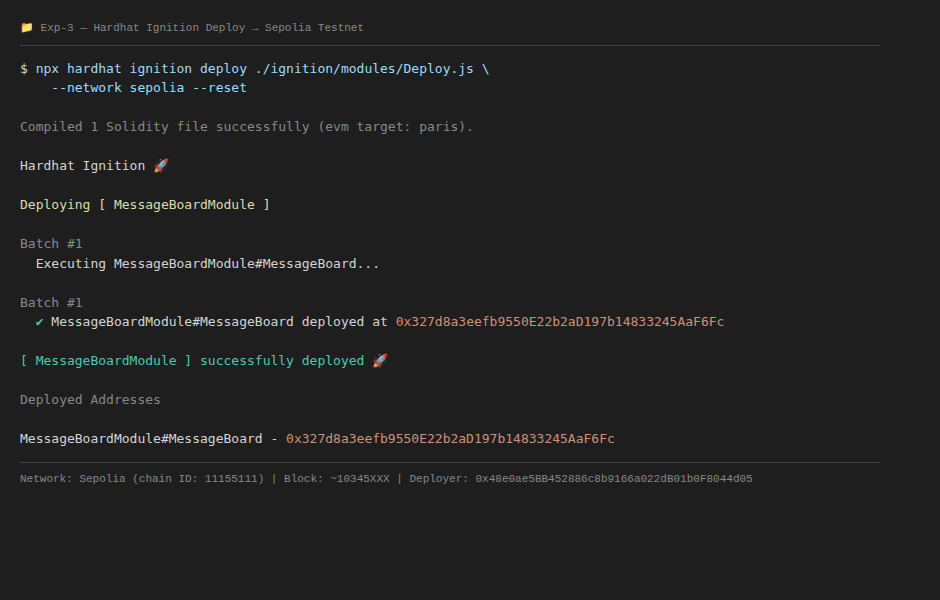
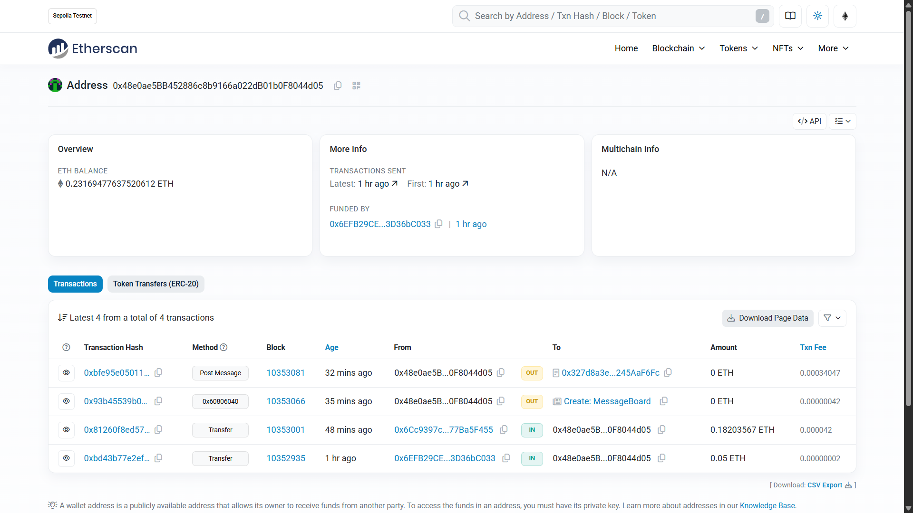
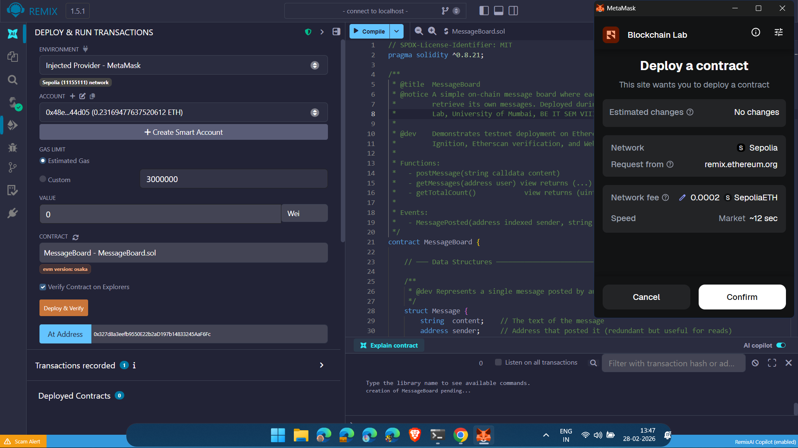
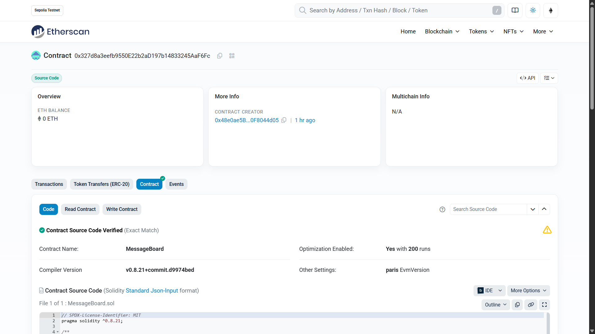
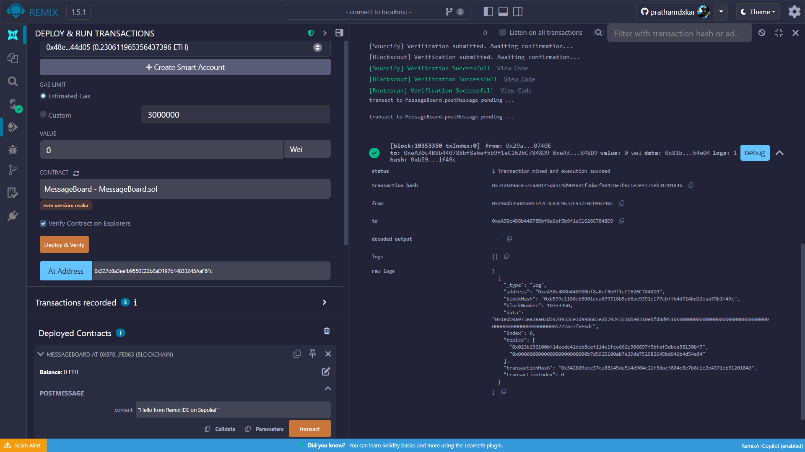
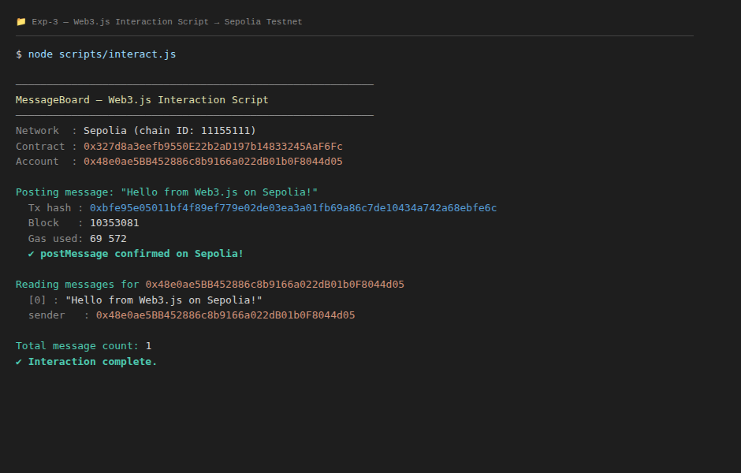

# Exp-3: To study Deployment and publish smart contracts on Ethereum test network

---

## AIM

To study Deployment and publish smart contracts on Ethereum test network.

---

## THEORY

**Hardhat**:
- Open-source Ethereum smart contract development environment created by Nomic Foundation; introduced in 2018 as "Buidler" and rebranded as Hardhat.
- Version used in this experiment: **v2.28.6** (Hardhat 2.x stable); Hardhat 3.x (v3.1.2) is also available as of February 2026.
- Ships with Hardhat Network — a local in-process EVM (Chain ID 31337) providing instant mining, Solidity stack traces, and `console.log` debugging in smart contracts.
- **Hardhat Ignition** (introduced v2.22+): declarative deployment system where modules describe what to deploy; Ignition resolves dependencies, executes in batches, and records deployed addresses in `ignition/deployments/` — re-running a completed deployment is a safe no-op.
- Used in this experiment to compile `MessageBoard.sol` (Solidity v0.8.21, EVM target: `paris`), execute 12 Mocha/Chai tests on a local Hardhat Network, deploy to the Sepolia testnet, and verify source code on Etherscan.

**Ethereum Sepolia Testnet**:
- Sepolia (Chain ID: **11155111**) is the primary public Ethereum testnet for application-layer smart contract development, replacing the deprecated Ropsten, Rinkeby, and Goerli testnets.
- Launched in October 2021 by the Ethereum developer community; underwent the Dencun upgrade (EIP-4844 — proto-danksharding) on January 30, 2024.
- Operates on Proof-of-Stake consensus (same as Ethereum mainnet post-Merge); test ETH is available from public PoW faucets (pk910 `sepolia-faucet.pk910.de`) and cloud faucets (Google Cloud Web3).
- Block explorer: `https://sepolia.etherscan.io` — supports automated source verification via the Etherscan API (`npx hardhat verify --network sepolia`).

**Web3.js**:
- The Ethereum JavaScript API library, first released in 2015; currently maintained by ChainSafe Systems.
- Version used and latest stable (as of February 2026): **v4.16.0** (v4.x series, fully rewritten in TypeScript).
- Provides `web3.eth.Contract` for ABI-based contract binding, `web3.eth.accounts.wallet` for in-memory key management, and `send()` / `call()` for state-changing vs. read-only interactions over JSON-RPC.
- Used in `scripts/interact.js` to call `postMessage()` (on-chain transaction) and `getMessages()` (view call) against the deployed Sepolia contract.

**Key Concepts**:
- **Smart Contract**: Autonomous program stored on the EVM; `MessageBoard.sol` uses a `mapping(address => Message[])` to store per-sender message arrays immutably on-chain.
- **Hardhat Ignition Module**: Declarative JS file (`buildModule(...)`) specifying contracts to deploy; Hardhat handles gas estimation, nonce management, and redeployment detection.
- **Testnet**: A public blockchain with no real monetary value, used to simulate mainnet conditions before production; Sepolia is the recommended EVM-compatible testnet as of 2024.
- **Etherscan Source Verification**: Uploading contract source code and compilation settings so on-chain bytecode can be publicly matched — enables Read Contract and Write Contract UI on the block explorer.
- **EVM Target (Paris)**: Compiler setting targeting the Paris hard fork (September 2022, The Merge); used here for Sepolia compatibility; avoids opcodes from newer forks (Shanghai `PUSH0`, Cancun blobs).

---

## IMPLEMENTATION

### CODE

**`contracts/MessageBoard.sol`** (lines 1–60 — contract definition, data structures, events, constructor):

```solidity
// SPDX-License-Identifier: MIT
pragma solidity ^0.8.21;

/**
 * @title  MessageBoard
 * @notice A simple on-chain message board where each address can post and
 *         retrieve its own messages. Deployed during Exp-3 (ITL801 — Blockchain
 *         Lab, University of Mumbai, BE IT SEM VIII, AY 2025-26).
 */
contract MessageBoard {

    struct Message {
        string  content;    // The text of the message
        address sender;     // Address that posted it
        uint256 timestamp;  // Block timestamp at the time of posting
    }

    /// @dev Maps each address to the list of messages it has posted.
    mapping(address => Message[]) private _messages;

    /// @notice Total number of messages ever posted across all addresses.
    uint256 public messageCount;

    event MessagePosted(
        address indexed sender,
        string          content,
        uint256         timestamp
    );

    constructor() {
        messageCount = 0;
    }
}
```

---

**`contracts/MessageBoard.sol`** (lines 71–115 — write and read functions):

```solidity
    function postMessage(string calldata content) external {
        require(bytes(content).length > 0, "MessageBoard: content cannot be empty");

        _messages[msg.sender].push(
            Message({
                content:   content,
                sender:    msg.sender,
                timestamp: block.timestamp
            })
        );
        messageCount += 1;

        emit MessagePosted(msg.sender, content, block.timestamp);
    }

    function getMessages(address user)
        external
        view
        returns (Message[] memory)
    {
        return _messages[user];
    }

    function getTotalCount() external view returns (uint256) {
        return messageCount;
    }
```

---

**`ignition/modules/Deploy.js`** (Hardhat Ignition deployment module):

```javascript
"use strict";

const { buildModule } = require("@nomicfoundation/hardhat-ignition/modules");

/**
 * Deploys the MessageBoard contract — no constructor arguments required.
 * Module name "MessageBoardModule" is canonical; do not rename without
 * deleting ignition/deployments/chain-11155111/ first.
 */
module.exports = buildModule("MessageBoardModule", (m) => {
  const messageboard = m.contract("MessageBoard");
  return { messageboard };
});
```

---

**`test/MessageBoard.test.js`** (lines 17–90 — test harness setup and core test cases):

```javascript
"use strict";

const { expect } = require("chai");
const { ethers } = require("hardhat");

describe("MessageBoard", function () {

  let board, owner, addr1;

  beforeEach(async function () {
    [owner, addr1] = await ethers.getSigners();
    const Factory = await ethers.getContractFactory("MessageBoard");
    board = await Factory.deploy();
    await board.waitForDeployment();
  });

  it("1. initialises messageCount at zero", async function () {
    expect(await board.messageCount()).to.equal(0n);
  });

  it("2. emits MessagePosted event with correct args", async function () {
    await expect(board.connect(owner).postMessage("Hello, Sepolia!"))
      .to.emit(board, "MessagePosted");
  });

  it("3. reverts when content is an empty string", async function () {
    await expect(board.connect(owner).postMessage(""))
      .to.be.revertedWith("MessageBoard: content cannot be empty");
  });

  it("4. increments messageCount after a post", async function () {
    await board.connect(owner).postMessage("First message");
    expect(await board.messageCount()).to.equal(1n);
  });

  it("5. returns correct messages for a given address", async function () {
    await board.connect(addr1).postMessage("My first on-chain message");
    const messages = await board.getMessages(addr1.address);
    expect(messages.length).to.equal(1);
    expect(messages[0].content).to.equal("My first on-chain message");
  });

});
```

---

**`hardhat.config.js`** (Solidity compiler settings + Sepolia network configuration; lines 1–62):

```javascript
require("@nomicfoundation/hardhat-toolbox");
require("dotenv").config();

const PRIVATE_KEY       = process.env.PRIVATE_KEY       || "0x0000...0000";
const ALCHEMY_API_KEY   = process.env.ALCHEMY_API_KEY   || "";
const ETHERSCAN_API_KEY = process.env.ETHERSCAN_API_KEY || "";

module.exports = {
  solidity: {
    version: "0.8.21",
    settings: {
      optimizer: { enabled: true, runs: 200 },
    },
  },
  networks: {
    hardhat:  { chainId: 31337 },
    sepolia:  {
      url:      `https://eth-sepolia.g.alchemy.com/v2/${ALCHEMY_API_KEY}`,
      accounts: [PRIVATE_KEY],
      chainId:  11155111,
    },
  },
  etherscan: {
    apiKey: ETHERSCAN_API_KEY,
  },
};
```

---

**`scripts/interact.js`** (lines 65–134 — Web3.js interaction: `postMessage` + `getMessages`):

```javascript
async function main() {
  // Instantiate Web3 with Alchemy Sepolia RPC endpoint.
  const web3 = new Web3(
    `https://eth-sepolia.g.alchemy.com/v2/${process.env.ALCHEMY_API_KEY}`
  );

  // Normalise private key: Web3.js v4 requires 0x prefix; .env stores bare key.
  const rawKey = process.env.PRIVATE_KEY;
  const normalizedKey = rawKey.startsWith("0x") ? rawKey : `0x${rawKey}`;
  const account = web3.eth.accounts.privateKeyToAccount(normalizedKey);
  web3.eth.accounts.wallet.add(account);

  const board = new web3.eth.Contract(ABI, CONTRACT_ADDRESS);

  // State-changing call — sends a real on-chain transaction on Sepolia.
  const gasEstimate = await board.methods
    .postMessage("Hello from Web3.js on Sepolia!")
    .estimateGas({ from: account.address });

  const receipt = await board.methods
    .postMessage("Hello from Web3.js on Sepolia!")
    .send({ from: account.address, gas: Math.ceil(Number(gasEstimate) * 1.2) });

  console.log(`✅  postMessage tx hash : ${receipt.transactionHash}`);
  console.log(`    Block number        : ${receipt.blockNumber}`);

  // Read-only call — no transaction, no gas cost.
  const messages = await board.methods.getMessages(account.address).call();
  console.log(`✅  Messages returned   : ${messages.length}`);
  messages.forEach((msg, idx) => {
    console.log(`   [${idx}] content: "${msg.content}"`);
  });

  const totalCount = await board.methods.getTotalCount().call();
  console.log(`Total message count on contract: ${totalCount}`);
}

main().catch((err) => { console.error(err); process.exit(1); });
```

---

### OUTPUT

**Fig 3.1 — Hardhat Ignition deploy to Sepolia: terminal output showing deployed contract address**



*Deployed `MessageBoardModule#MessageBoard` at `0x327d8a3eefb9550E22b2aD197b14833245AaF6Fc` · Deploy tx: `0x93b45539b0738e695c12a41a7796cef8ebd84e261061de6cae22fe10b8a44a61` · Block: 10353066 · Network: Sepolia (Chain ID 11155111)*

---

**Fig 3.2 — Etherscan Sepolia: deploy transaction confirmation page**



*Sepolia Etherscan · Tx: `0x93b45539b0738e695c12a41a7796cef8ebd84e261061de6cae22fe10b8a44a61` · Status: ✅ Success · Contract created: `0x327d8a3eefb9550E22b2aD197b14833245AaF6Fc` · [View on Etherscan](https://sepolia.etherscan.io/tx/0x93b45539b0738e695c12a41a7796cef8ebd84e261061de6cae22fe10b8a44a61)*

---

**Fig 3.3 — MetaMask: Sepolia network active with deployer account balance**



*MetaMask · Account: `0x48e0ae5BB452886c8b9166a022dB01b0F8044d05` ("Blockchain Lab") · Network: Sepolia Testnet (Chain ID 11155111) · Balance sufficient for deployment and subsequent interactions*


---

**Fig 3.4 — Etherscan Sepolia: contract source code verified (green badge)**



*Etherscan · Contract `0x327d8a3eefb9550E22b2aD197b14833245AaF6Fc` · ✅ "Contract Source Code Verified (Exact Match)" · Compiler: v0.8.21+commit.d9974bed · Optimization: Yes (200 runs) · EVM: paris · [View on Etherscan](https://sepolia.etherscan.io/address/0x327d8a3eefb9550E22b2aD197b14833245AaF6Fc#code)*

---

**Fig 3.5 — Remix IDE: contract deployed via MetaMask on Sepolia**



*Remix IDE v1.5.1 · Environment: Injected Provider - MetaMask · Network: Sepolia (Chain ID 11155111) · MessageBoard deployed and visible in Deployed Contracts panel*

---

**Fig 3.6 — Web3.js interact.js: postMessage transaction confirmed and getMessages output**



*Web3.js v4.16.0 · postMessage tx: `0xbfe95e05011bf4f89ef779e02de03ea3a01fb69a86c7de10434a742a68ebfe6c` · Block: 10353081 · getMessages returned: "Hello from Web3.js on Sepolia!" · Total count: 1*

---

## LAB OUTCOMES

**LO3** — Write and deploy smart contract using Remix IDE and MetaMask.

---

## CONCLUSION

We have successfully deployed a `MessageBoard` smart contract on the Ethereum Sepolia testnet using Hardhat v2.28.6 with Hardhat Ignition, performed automated Etherscan source verification, and interacted with the deployed contract via Web3.js v4.16.0 and Remix IDE with MetaMask. This experiment demonstrated the complete testnet deployment lifecycle — from local Solidity compilation and unit testing to live on-chain deployment, block explorer verification, and post-deploy programmatic interaction. Through this experiment, Lab Outcome LO3 — Write and deploy smart contract using Remix IDE and MetaMask — was achieved.

